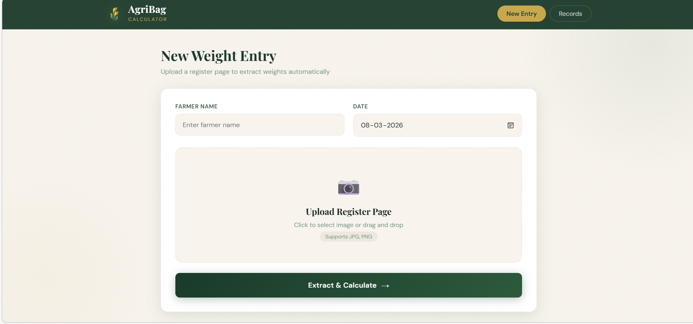
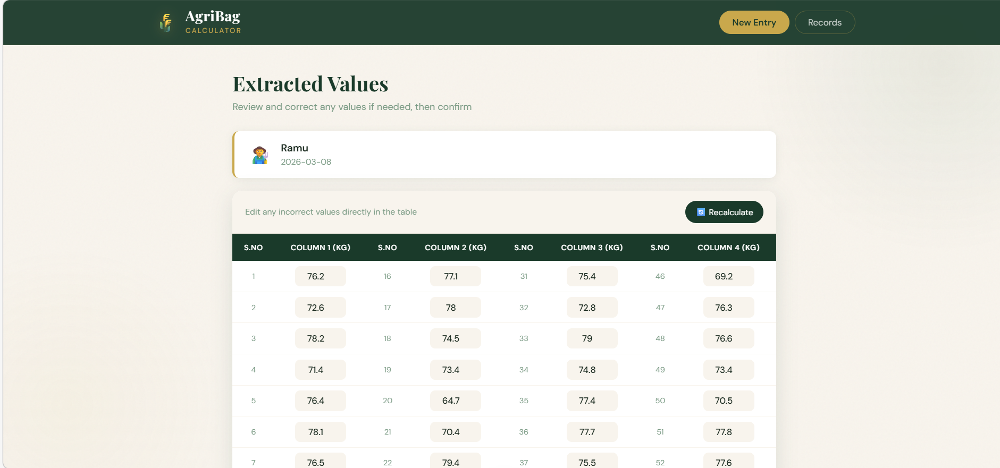
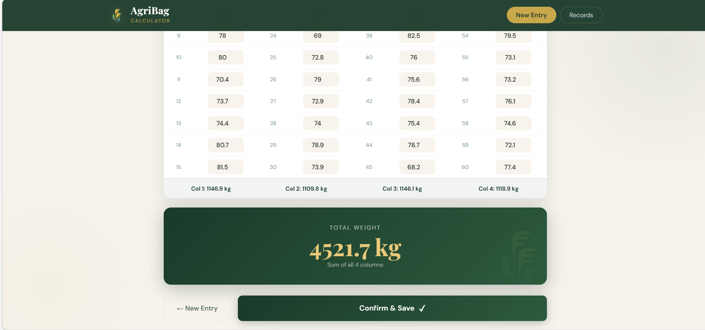
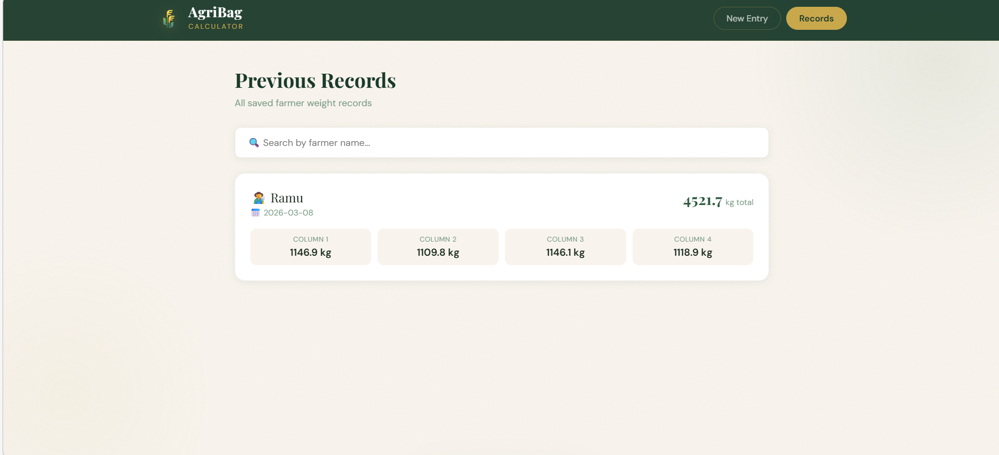

# 🌾 AgriBag Calculator

An AI-powered web application that extracts handwritten weight values from paddy register pages using Vision LLM, calculates column sums and totals, and stores farmer records.

**Live Demo:** https://incomparable-gelato-fd76c2.netlify.app/

---

## 📸 Screenshots

### Upload Page


### Extracted Values & Manual Correction



### Records


---

## 📌 Problem Statement

Paddy trading businessmen maintain handwritten weight registers with 60 values across 4 columns and 15 rows each. Manually adding all values is time-consuming and error-prone. AgriBag Calculator automates this by reading the register page photo and instantly calculating all sums.

---

## ✨ Features

- 📷 **Image Upload** — Upload a photo of any handwritten weight register page
- 🤖 **AI Extraction** — Automatically extracts all 60 weight values using Groq Vision LLM
- ✏️ **Manual Correction** — Editable table to fix any misread values before saving
- 🔄 **Live Recalculate** — Instantly recalculates sums when values are edited
- 💾 **Save Records** — Stores farmer name, date, column sums and total in a database
- 🗑️ **Delete Records** — Delete settled records to keep the list clean
- 🔍 **Search Records** — Search past records by farmer name
- 📱 **Responsive Design** — Works on mobile and desktop

---

## 🛠️ Tech Stack

| Layer | Technology |
|-------|-----------|
| Frontend | HTML, CSS, JavaScript |
| Backend | Python, FastAPI |
| AI/OCR | Groq API (Llama 4 Scout Vision) |
| Database | SQLite |
| Deployment | Render (backend) + Netlify (frontend) |

---

## 🗂️ Project Structure

```
AGRI-BAG-CALCULATOR/
│
├── backend/
│   ├── uploads/
│   │   └── .gitkeep
│   ├── database.py          # SQLite database operations
│   ├── image_processor.py   # Image processing & value extraction
│   ├── main.py              # FastAPI server & API endpoints
│   ├── ocr_engine.py        # Groq Vision API integration
│   ├── Procfile             # Render deployment config
│   └── requirements.txt     # Python dependencies
│
├── frontend/
│   ├── index.html           # UI structure
│   ├── script.js            # Frontend logic
│   └── style.css            # Styling
│
├── assets/                  # Screenshots
├── .gitignore
└── README.md
```

---

## 🚀 Run Locally

### Prerequisites
- Python 3.11+
- Groq API key (free at [console.groq.com](https://console.groq.com))

### Steps

**1. Clone the repository**
```bash
git clone https://github.com/Satya-05/agribag-calculator.git
cd agribag-calculator
```

**2. Create virtual environment**
```bash
python -m venv venv
venv\Scripts\activate  # Windows
```

**3. Install dependencies**
```bash
cd backend
pip install -r requirements.txt
```

**4. Create `.env` file in root folder**
```
GROQ_API_KEY=your_groq_api_key_here
```

**5. Start the backend**
```bash
cd backend
uvicorn main:app --reload
```

**6. Start the frontend** (new terminal)
```bash
cd frontend
python -m http.server 5500
```

**7. Open in browser**
```
http://127.0.0.1:5500
```

---

## 📡 API Endpoints

| Method | Endpoint | Description |
|--------|----------|-------------|
| GET | `/` | Health check |
| POST | `/process-image` | Upload image and extract values |
| POST | `/save-record` | Save a farmer record |
| DELETE | `/records/{id}` | Delete a record by ID |
| GET | `/records` | Get all records |
| GET | `/records/{farmer_name}` | Get records by farmer name |

---

## 📸 Register Format

The app reads registers with this layout:

| S.No | KG's | S.No | KG's | S.No | KG's | S.No | KG's |
|------|------|------|------|------|------|------|------|
| 1-15 | Col 1 | 16-30 | Col 2 | 31-45 | Col 3 | 46-60 | Col 4 |

Total = Col1 + Col2 + Col3 + Col4

---

## 🤖 AI Model

Uses **Groq API** with **Llama 4 Scout 17B Vision** model for handwriting recognition. The model handles:
- Whole numbers (70, 68, 65...)
- Dash notation decimals (43-5 → 43.5)
- Dot notation decimals (76·2 → 76.2)
- Empty cells (returns 0)
- Cancelled/crossed values (returns 0)